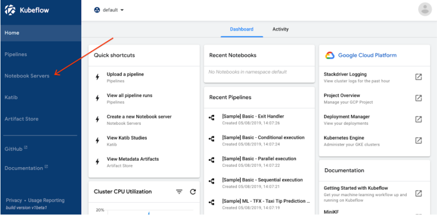
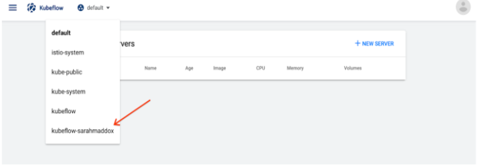
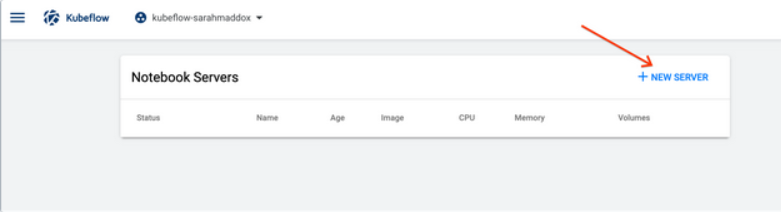
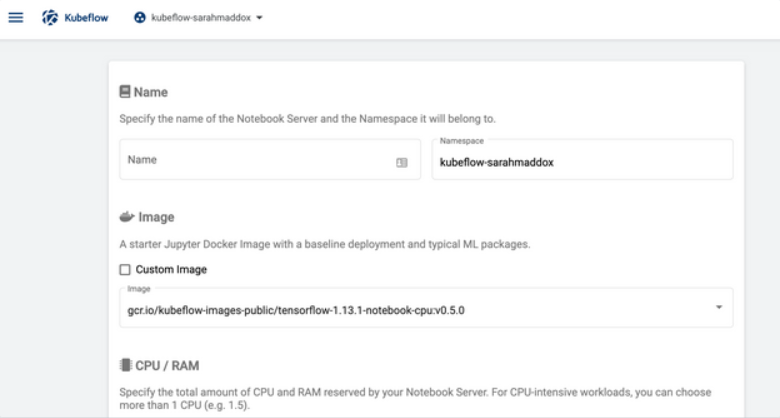
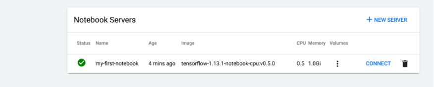
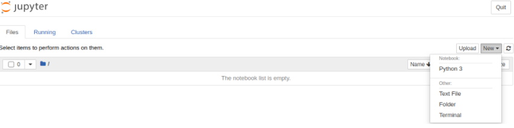
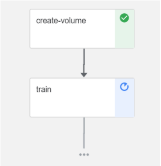

# Building a Kubeflow Pipeline

[Kubeflow Pipeline](https://www.kubeflow.org/docs/pipelines/overview/pipelines-overview/)  is a component of Kubeflow which helps to manage end-to-end machine learning workflow. It aims to reduce the complexity and time involved with training and deploying machine learning models at scale.

In this example, we would be working on a supervised learning classification problem using an Artificial Neural network. The goal is to determine if a customer would churn/leave or not.

### Step 1:
The first step is to make sure you have successfully deployed kubeflow, all its dependencies and  have access to the dashboard. There are many ways to deploy kubeflow. It can be deployed on your system(MacOs, Windows, Linux) and on the cloud(GCP, AWS, IBM, Azure). The following links should guide on how to deploy kubeflow on different platforms:

    Deploy Kubeflow on Windows
    Deploy Kubeflow on MacOs
    Deploy Kubeflow on Linux
    Deploy Kubeflow on GCP
    Deploy Kubeflow on AWS
    Deploy Kubeflow on IBM
    Deploy Kubeflow on Azure

For this example we would be using **GCP** to build the pipeline. To hasten the process we have put together the following steps for deploying Kubeflow on GCP.

    1. Create a new project 

    2. Enable boost shell on cloud shell

    3. Enable deployment manager API

    4. Setup OAuth credentials

    5. Setup environmental files and enable other APIs
    
        a. export DEPLOYMENT_NAME=kf-codelab
        b. export PROJECT_ID=your-project-id
        c. export ZONE=us-central1-c or us-east1-c
        d. gcloud config set project ${PROJECT_ID}
        e. gcloud config set compute/zone ${ZONE}
        f. gcloud services enable   cloudresourcemanager.googleapis.com   iam.googleapis.com   file.googleapis.com  ml.googleapis.com

    6. Download kfctl v1.0 on the cloud shell with  
    wget https://github.com/kubeflow/kfctl/releases/download/v1.1.0/kfctl_v1.1.0-0-g9a3621e_linux.tar.gz

    7. Extract the downloaded package with tar -xvf kfctl_v1.1.0-0-g9a3621e_linux.tar.gz

    8. Export kfctl path using export PATH=$PATH:/home/home-name/
    go to home directory using cd
    Get the current directory with pwd

    9. Authorize gcloud with gcloud auth login and gcloud auth application-default login

    10.set config_uri 
    export CONFIG_URI="https://raw.githubusercontent.com/kubeflow/manifests/v1.0-branch/kfdef/kfctl_gcp_iap.v1.0.2.yaml"

    11. Set up oauth secret 
    export CLIENT_ID=your-auth-client-id 
    export CLIENT_SECRET=your-oauth-client-secret

    12. Setup kubeflow environment variables 
    KF_NAME=kf-codelab 
    BASE_DIR=${HOME}/kf_deployments 
    export KF_DIR=${BASE_DIR}/${KF_NAME}

    13. Apply Kubeflow 
    mkdir -p ${KF_DIR}
    cd ${KF_DIR} 
    kfctl apply -V -f ${CONFIG_URI}

    14. Create Cluster 
    gcloud container clusters get-credentials ${KF_NAME} --zone ${ZONE} --project ${PROJECT_ID} 
    kubectl -n kubeflow get all 
    kubectl -n istio-system get ingress

### Step 2:
Once you have followed the steps and deployed kubeflow on GCP, paste the link given in your browser to get access to the Kubeflow dashboard. 

Start by setting up a jupyter notebook through the Notebook Servers tab by following the steps below: 
1. Click Notebook Servers in the left-hand panel of the Kubeflow UI.
2. Click the **namespace** dropdown and choose the one that corresponds to your Kubeflow profile.

3. Click **NEW SERVER**  at the top right corner of the Notebook Servers page to create a notebook server.

4. Enter the details of your new server on the page that shows next.

        a. Give a name of your choice to the notebook server
        b. The namespace is automatically updated by kubeflow
        c. Select a Docker image. You can either use a custom image you created or
        d. One of the standard images. If you select a custom image you have to specify the docker image in the form: registry/image:tag
    
5. Specify the total amount of **CPU** that your notebook server should reserve.
6. Specify the total number of memory your notebook server should reserve.

7. Specify a **workspace volume** to hold your personal workspace for this notebook server. Kubeflow provisions a Kubernetes persistent volume(PV) for your workspace volume. The PV ensures that you can retain data even if you destroy your notebook server.

The default is to create a new volume for your workspace with the following configuration:

**Name**: The volume name is synced with the name of the notebook server, and has the form workspace-<server-name>. When you start typing the notebook server name, the volume name appears. You can edit the volume name, but if you later edit the notebook server name, the volume name changes to match the notebook server name.
    
**Size**: 10Gi

**Access mode**: ReadWriteOnce. This setting means that the volume can be mounted as read-write by a single node. 

**Mount point**: /home/jovyan

Alternatively, you can point the notebook server at an existing volume by specifying the name of the existing volume.

8. Click **LAUNCH** and you should see a new Notebook server entry like below.

### Step 3:
Once the server is set up, click **connect** for access to your jupyter notebook. Open up the terminal and clone the following repository on GitHub.

    $ git clone https://github.com/AdeloreSimiloluwa/Artificial-Neural-Network

Open the file “[Artificial Neural Networks Pipeline](https://github.com/AdeloreSimiloluwa/Artificial-Neural-Network/blob/master/Artificial%20Neural%20Networks%20Pipeline%20(1).ipynb)”. The data needed for this project has already been uploaded on git so you can proceed to run each cell in the notebook. Start by importing the libraries and restart the kernel. The next step is to import the data and preprocess.

    !python -m pip install --user --upgrade pip

    !pip3 install google-cloud-bigquery==1.6.0 pandas==0.23.4 matplotlib==3.0.3 scipy==1.2.1 scikit-learn==0.22 tensorflow==2.0 keras==1.2.2 --user

### Step 4:
Now installing the kubeflow pipeline SDK. The [kubeflow pipeline SDK](https://www.kubeflow.org/docs/pipelines/sdk/sdk-overview/) offers python packages that you can use to run your machine learning workflows. To install SDK, run this cell and restart your kernel.

    !pip install -q kfp --upgrade --user

### Step 5:
Create python functions for training, testing and prediction and convert them into containers with this function, [func to container op](https://kubeflow-pipelines.readthedocs.io/en/latest/source/kfp.components.html#kfp.components.func_to_container_op).

  **Training function:**
  
    def train(data_path, model_file):
    # Define the model using Keras.
    classifier = keras.models.Sequential()
    classifier.add(keras.layers.Dense(units =6, activation='relu', input_dim=11))
    classifier.add(keras.layers.Dense(units =6, activation='relu'))
    classifier.add(keras.layers.Dense(units =1, activation='sigmoid'))

    classifier.summary()

    classifier.compile(optimizer = 'adam', loss='binary_crossentropy' 
                    , metrics =['accuracy'])

    return classifier

**Predict function:**

    def predict(data_path, model_file, churn_rate):
    # Load the saved Keras model
    classifier = keras.models.load_model("trained_model")

    # Load and unpack the test_data
    with open(os.path.join("test_data"),'rb') as f:
        test_data = pickle.load(f)
    # Separate the test_images from the test_labels.
    X_test,  y_test = test_data

    churn_rate = int(churn_rate)

    # make predictions.
    y_pred = classifier.predict(X_test)

    # create a threshold for the confusion matrix
    y_pred=(y_pred>0.5)
    
    with open(f'result.txt', 'w') as result:
        result.write(" Prediction: {} ".format(y_pred))
    
    print('Prediction has be saved successfully!')

Now wrap the up into container components with:

    name = comp.func_to_container_op(func)

Parameters : func is the python function you intend to convert

### Step 6:
Usually, when defining the kubflow pipeline, one would have to manually manipulate a YAML file, but with Kubeflow Pipelines SDK you can define your pipeline with :

    @dsl.pipeline(name= "", description = "")

Before this, you need to initialize a kubeflow client that would enable communication with the Pipelines API server so you can create runs and experiment from your jupyter notebook.

    client = kfp.Client()

After this, you define the parameters that should go into the pipeline. In this case we first define the data path, the model path(where the model is stored), and the index of the test data you want predicted.

    # Define parameters to be fed into pipeline
    def churn_container_pipeline(
        data_path: str = DATA_PATH,
        model_file: str= MODEL_FILE, 
        churn_rate: int = CHURN_RATE
    ):

### Step 7:
Now we can define the pipeline components, compile and run it on the dashboard. With [ContainerOp](https://kubeflow-pipelines.readthedocs.io/en/latest/source/kfp.dsl.html#kfp.dsl.ContainerOp) func we would define the components, order of operations  and dependencies of the pipeline.

Here we create the training components and attach [persistent volumes](https://kubernetes.io/docs/concepts/storage/persistent-volumes/) to be mounted to the container.

    # Define volume to share data between components.
    vop = dsl.VolumeOp(
    name="create_volume",
    resource_name="data-volume", 
    size="4Gi", 
    modes=dsl.VOLUME_MODE_RWM)
    
    # Create churn training components.
    churn_training_container = train_op(data_path, model_file) \
                                    .add_pvolumes({data_path: vop.volume})

    # Create a Churn prediction component.
    churn_predict_container = predict_op(data_path, model_file, churn_rate) \
                         .add_pvolumes({data_path: churn_training_container.pvolume})

Now print your results:
    # Print the result of the prediction
    churn_result_container = dsl.ContainerOp(
        name="print_prediction",
        image='gcr.io/kubeflow-images-public/tensorflow-2.1.0-notebook-cpu:1.0.0',
        pvolumes={data_path: churn_predict_container.pvolume},
        arguments=['cat', f'{data_path}/result.txt']
    )

**ContainerOp parameters include:**

**name** - the name displayed for the component execution during runtime.

**image** - image tag for the Docker container to be used.

**pvolumes** - dictionary of paths and associated Persistent Volumes to be mounted to the container before execution.

**arguments** - command to be run by the container at runtime.

Run the next two cells to compile the pipeline and run it within an experiment. Click run to view your pipeline on the Kubeflow pipeline UI.

   **Run the Pipeline**
   
    DATA_PATH = '/churn'
    MODEL_PATH='churn_classifier.h5'
    # An integer representing an image from the test set that the model will attempt to predict the label for.
    CHURN_RATE = 3

    pipeline_func = churn_container_pipeline

    experiment_name = 'costumer_churn_kubeflow'
    run_name = pipeline_func.__name__ + ' run'

    arguments = {"data_path":DATA_PATH,
                 "model_file":MODEL_PATH,
                 "churn_rate": CHURN_RATE}

    # Compile pipeline to generate compressed YAML definition of the pipeline.
    kfp.compiler.Compiler().compile(pipeline_func,  
      '{}.zip'.format(experiment_name))

    # Submit pipeline directly from pipeline function
    run_result = client.create_run_from_pipeline_func(pipeline_func, 
                                                      experiment_name=experiment_name, 
                                                      run_name=run_name, 
                                                      arguments=arguments)

The components you defined in the notebook should be displayed on the UI.
Once the components are done running you can check the logs for your prediction result. It would display the Churn rate for the index you provide, the level of confidence and the actual label for that index.
